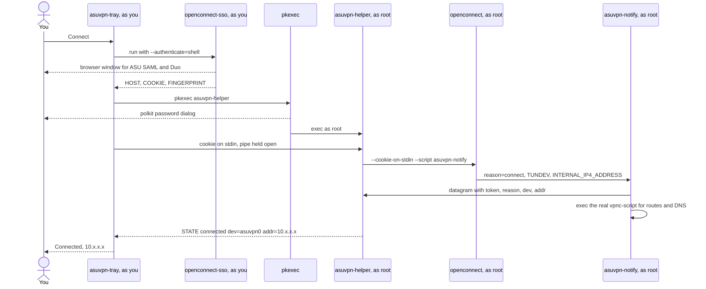
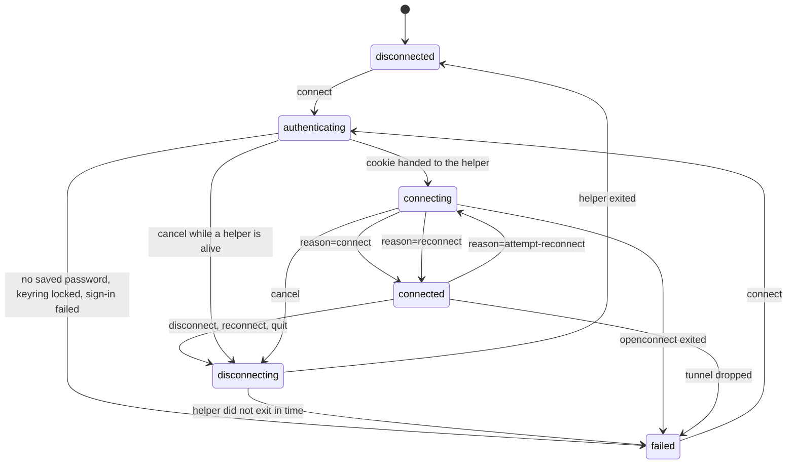

# Design notes

Internals, for anyone reading or changing the code. The
[README](README.md) is the user-facing document; this one assumes you have it
open in another tab and are looking at the source.

One theme runs through the bug history, and it is worth naming before anything
else: **the failures here are things that report success while doing nothing.**
Matching a log line openconnect stopped printing. Chaining to a `vpnc-script`
path that does not exist on this distribution. Comparing whole `argv` elements
when `getopt` bundles short options. `pipx inject` skipping a pin because
*some* `setuptools` was already present, and exiting 0. In every case the exit
status said fine, the code was inert, and nothing noticed until it mattered.

The response is the same each time: **check the effect, not the exit status**,
and prefer asking the installed software over remembering what it does.

The short version of the design: **openconnect must always get to run
`vpnc-script` on the way out.** Almost every unusual decision here — relaying
output instead of sharing a pipe, the control pipe, `PR_SET_PDEATHSIG`, the
single-reaper rule, the generous signal graces — exists because the failure mode
is a machine with no working network until it reboots.

**Contents**

- [The contract](#the-contract)
- [Processes and privilege](#processes-and-privilege)
- [What happens on connect](#what-happens-on-connect)
- [The state machine](#the-state-machine)
- [Where state comes from](#where-state-comes-from)
- [Concurrency](#concurrency)
- [Watching the tunnel](#watching-the-tunnel)
- [Two orderings that are load-bearing](#two-orderings-that-are-load-bearing)
- [Teardown](#teardown)
- [Exit codes](#exit-codes)
- [Invariants](#invariants)
- [How this is tested](#how-this-is-tested)
- [Changing things](#changing-things)

---

## The contract

[`asuvpn_contract.py`](asuvpn_contract.py) holds everything more than one
program has to know: the wire format the helper speaks to the tray, the verbs
the tray speaks back, the fields `asuvpn-notify` puts on the event socket, the
reasons `openconnect` reports, and the settings schema.

It exists because each of those had been restated wherever it was needed, and
most had drifted. Five message prefixes, each parsed by its own string test in
the tray — and one of them keyed on the *wording* "refusing", which four of the
seven refusals did not use, so those reached the user as a bare exit number. Two
unrelated config mechanisms, a line of text and the presence of a file. Nine
tunables split across two programs with no way for anyone to change them.

| Section | Defines |
| --- | --- |
| Messages | `MESSAGE_PREFIX`, `RELAY_PREFIX`, the five kinds, `encode_message` / `decode_message` / `encode_relay` |
| Control | the verbs the tray writes to the helper's stdin |
| Events | the variable names, the field order, `encode_event` / `decode_event` |
| openconnect | `REASON_STATES`, `INTERFACE_RE` |
| Settings | the schema, the parser, and the generator that writes the file |

### Loaded, not imported

`asuvpn-helper` and `asuvpn-notify` run isolated (`-I`) so that their own
directory is deliberately *not* on `sys.path` — that is what stops a `signal.py`
dropped beside them being executed as root. And `asuvpn-tray` is reached through
a symlink in `~/.local/bin`, so its `sys.path[0]` is that directory rather than
the one its siblings live in. An explicit path built from the resolved location
is the only form correct for all three.

Each program therefore carries an eight-line loader, and that duplication is
irreducible: code cannot be shared before the mechanism that shares it has been
loaded. It is the only thing in this project stated more than once on purpose.
The privileged programs verify the directory for write access by a second
principal before executing anything; the unprivileged ones do not, because
loading a file you own as yourself crosses no boundary — and refusing there
would break `--link` mode from an ordinary umask-002 checkout.

### What is executed as root, and what checks it

Four things run or are loaded with privilege: `asuvpn-helper`, its directory,
`asuvpn-notify`, and `asuvpn_contract.py`. The contract joined that set when it
was introduced and was missed by both the helper's runtime list and the
self-test's — the loader checked it, so nothing broke, but a list that
enumerates "the programs I know about" stops covering a new file that runs with
the same privilege. Both lists name all four now.

Verified by tampering rather than by reading: making the contract
world-writable, making its directory world-writable, and replacing it with a
symlink to a writable file are each refused, the last because `os.stat` follows
the link and sees the target. A *shared group* is refused too, though that one
is covered by the logic tier's truth table rather than end to end — a user
namespace maps only one gid, so a second principal cannot be created inside the
sandbox to test it with.

### Settings belong to the user side

The helper runs as root, where `~` is root's home. It therefore never reads the
config file: the tray resolves the settings and passes what the helper needs as
explicit arguments (`--dpd`). A privileged process reading a file an
unprivileged account can write is a trust boundary crossed for no reason.

## Processes and privilege

Four programs, two privilege levels.

| Program | Runs as | Lifetime | Owns |
| --- | --- | --- | --- |
| `asuvpn-tray` | you | the desktop session | the UI, the state machine, the CLI, the single-instance socket |
| `asuvpn-helper` | **root**, via `pkexec` | one tunnel | `openconnect`'s lifetime, teardown, the event socket |
| `asuvpn-notify` | **root**, run by `openconnect` | one transition | reporting one event, then chaining to the real `vpnc-script` |
| `asuvpn-selftest` | you | one run | checking the install against the machine |
| `asuvpn_contract.py` | — | loaded by all four | the agreement between them; never executed as a program |

`openconnect-sso` and the Qt browser it opens run **as you**. The only thing
that crosses the privilege boundary is the session cookie, on stdin.

The helper does not `exec` and step aside. It stays as `openconnect`'s parent
for the whole tunnel, because being the parent is what makes the control pipe
and `PR_SET_PDEATHSIG` work.

## What happens on connect



The cookie never appears on a command line, so `ps` cannot show it, and it is
never written to the log.

## The state machine

Six states. The tray holds exactly one, and every transition happens on the GLib
main loop — worker threads post through `GLib.idle_add` rather than assigning.



Both state sources — the script contract and the log-matching fallback — reach
`CONNECTED` and `CONNECTING` through `_announce_connected` and
`_announce_link_lost` rather than setting state themselves. They had each built
their own message, and the two had already drifted: one announced a recovery as
a fresh connection, and neither said anything at all when the link dropped.

The wording distinguishes what a transition costs. *VPN connection lost* and
*VPN reconnecting* are free — same session, no sign-in — while *VPN signing in
again* is the only one that will interrupt the user, so it is the only one
phrased as an action being taken on their behalf.

`failed` is a real state, not an error path: it keeps the last useful sentence
(`last_failure`) so the user is told *why*, and it shows the attention icon.

Two rules that are easy to break and were both broken at some point:

- **Nothing may leave `disconnecting` except teardown finishing.** A late
  `reconnect` event arriving mid-teardown used to flip the badge back to
  `connected`, after which a clean user-requested disconnect was reported as
  `connection dropped`.
- **`reconnect` stays busy the whole way through.** It sets `disconnecting`
  with `reconnect_pending`, so `asuvpn reconnect --wait` cannot mistake the
  momentary gap for completion.

## Where state comes from

Three sources, in strict order of authority.

| Source | Gives | Used |
| --- | --- | --- |
| **Script contract** (`asuvpn-notify` → helper → `[helper] STATE …`) | `reason`, device, assigned address | always, when the channel is up |
| **`/sys/class/net/<dev>/ifindex`** | proof the device is the one we created | teardown ownership only |
| **Log patterns** | a guess | fallback only, disabled the moment a real event arrives |

`openconnect` runs `vpnc-script` at every transition with the state in the
environment. The mapping the helper applies:

| `reason` | Tray state | What you see |
| --- | --- | --- |
| `pre-init` | *(none)* | nothing — the tunnel is not configured yet |
| `connect` | `connected` | **Connected — 10.x.x.x** |
| `attempt-reconnect` | `connecting` | **Connecting… — link lost, retrying** |
| `reconnect` | `connected` | **Connected — 10.x.x.x** (address may have changed) |
| `disconnect` | *(deferred)* | left to the exit path, which knows whether you asked for it |

### Why the contract and not the log

The log wording is not an interface. `openconnect` renamed its success line to
`Configured as …` in v8, and v9.12 contains no `Connected as` string at all — so
matching on that meant the applet could only reach `connected` when DTLS
happened to negotiate. On a network blocking UDP/443, the tunnel worked while
the tray sat in "Connecting…" forever.

The five `reason` values are inherited from vpnc, documented, and unchanged
across that rename. They are present in the installed binary — `connect` and
`reconnect` do not show up in `strings` output only because the linker
tail-merges them into `attempt-reconnect`:

```
attempt-reconnect  0x7420a
      reconnect    0x74212   = 0x7420a + 8
        connect    0x74214   = 0x74212 + 2
```

and the installed `/usr/share/vpnc-scripts/vpnc-script` enumerates exactly those
five in its own `case "$reason"` statement.

### Chaining, and why the script path is derived

Passing `--script` **replaces** openconnect's compiled-in default. That path
differs by distribution — `/usr/share/vpnc-scripts/vpnc-script` on Debian and
Ubuntu, `/etc/vpnc/vpnc-script` on Fedora and Arch, anything in a source build —
so it is read from `openconnect --version`, which reports it, rather than
assumed. Hardcoding it is the same mistake as hardcoding log text, with a worse
outcome: chain to a path that is not there and `sh` returns 127, `openconnect`
logs `Script … returned error 127` and carries on, and the tunnel comes up with
no routes and no DNS while the tray shows **Connected**.

If the resolved script is missing or not executable, the helper **does not
interpose at all** — no `--script` is passed, openconnect keeps its own default,
and state falls back to log matching. Losing state precision is a fair trade;
losing the routing table is not.

### Framing

`openconnect`'s output and the helper's own messages share one pipe, so
everything from `openconnect` is prefixed `[vpn] ` and only `[helper] ` lines
are trusted. Without that, a VPN banner containing `[helper] WARNING:` could
raise a desktop notification with text the server chose, and
`[helper] STATE connected` could drive the badge.

Two smaller rules fall out of the same idea, both enforced where the line is
*built* rather than trusted from the sender:

- a device name that could not name a device is rejected, because it is about
  to become a path component under `/sys/class/net`;
- every field is collapsed to a single whitespace-free token, because a newline
  would end the line early and a **space** would silently add a second `addr=`
  — and parsing keeps the last one.

## Concurrency

### asuvpn-tray

The GLib main loop owns all state and all GTK. Everything else posts to it.

| Thread | Job | Notes |
| --- | --- | --- |
| main loop | state, UI, every transition | worker threads reach it only via `GLib.idle_add` |
| `_auth_thread` | runs `openconnect-sso`, parses HOST/COOKIE/FINGERPRINT | holds its `Popen` in a local, never re-reads `self.auth_proc` |
| `_pump` | drains sign-in stderr into the log | |
| `_tunnel_thread` | reads the helper's output, then reaps it | the **only** caller of `helper.wait()` |
| teardown workers | `_disconnect_thread`, `_reconnect_thread`, `_cancel_tunnel_thread`, `_quit_thread` | wait on an `Event`, never on `wait()` |
| IPC loop | accepts CLI connections, checks `SO_PEERCRED` | runs actions on the main loop and waits for them |

| Lock / primitive | Protects |
| --- | --- |
| `_log_lock` | the in-memory log tail and the log file |
| `_stdin_lock` | the helper's stdin, and the `(helper_proc, helper_exited)` pair — published together so a teardown cannot pair one generation's pipe with another's event |
| `_auth_lock` | the sign-in `Popen` handle, read exactly once |
| `helper_exited` (Event) | how teardown waits, instead of a second `wait()` |
| `_status` (tuple) | state and detail published as one object, so the IPC thread cannot read a new state beside an old detail |

**Generation counters.** `helper_generation` and `auth_generation` are bumped on
every new tunnel and every new sign-in. A helper that is still dying must not be
able to report its exit over the top of its replacement — that would drop the
tray's only handle on a live root `openconnect`. Likewise a sign-in still in
flight must not start a tunnel on top of a newer one; `cancelled` alone is not
enough, because a new connect clears it.

### asuvpn-helper

| Thread | Job |
| --- | --- |
| main | parks in `Tunnel.reap()` — the **only** caller of `Popen.wait()` |
| `serve_events` | reads the datagram socket, emits `[helper] STATE …` |
| `watch_for_interface` | polls `/sys` for our device's ifindex, as a second source |
| `relay_output` | forwards `openconnect`'s output, prefixed |
| `watch_control_channel` | reads stdin; `quit` or EOF starts teardown |
| signal handler | spawns a `shutdown` worker — it runs on the main thread, which is parked |

### The one-reaper rule

CPython keeps a per-process `_waitpid_lock`. A **timed** wait acquires it
non-blockingly, so if another thread is already parked in a blocking
`Popen.wait()`, every timed wait times out no matter how fast the child exits.

This was not academic. A clean teardown looked like a hang and escalated all the
way to `SIGKILL` — which is precisely the thing that stops `vpnc-script` from
restoring the routing table. Hence: exactly one thread calls `wait()` per child,
and everyone else waits on an `Event`.

`preexec_fn` is used once, in the helper, and is safe only because the helper
has started no threads at that point. `parent_pid` is captured **before** the
`Popen`, because `preexec_fn` runs in the child and `os.getpid()` there returns
the child's own pid — which made the guard fire every time and killed
`openconnect` before it started.

## Watching the tunnel

### Why anything is needed

`openconnect` re-establishes the tunnel on its own when dead peer detection
fails, reusing the session cookie. That path is free — no sign-in, no Duo, no
polkit — and the applet should stay out of its way.

Two things defeat it, and both produce the same symptom: everything reports
connected and nothing flows.

**The server turns DPD off.** ASU negotiates `CSTP connected. DPD 0, Keepalive
0`. With no probes and no keepalives there is no mechanism to notice the far end
stopped answering, so `openconnect` waits forever. The helper therefore passes
`--force-dpd 30`, documented as using DPD "even if the server hasn't requested
it". Getting the interval wrong is cheap — a DPD failure re-establishes with the
same cookie — so this errs toward checking.

**The break is local.** A resume from suspend, a network change, or another
daemon rewriting the routing table can leave the socket healthy while the routes
that make the tunnel useful are gone. DPD passes, because the far end really is
answering. Nothing below the applet can see this.

### What is checked, and what is deliberately not

Every check runs on the GLib main loop every `HEALTH_INTERVAL` seconds and is a
couple of reads from `/sys` and `/proc` — no packets, no subprocess. Two
consecutive bad checks are required, because routes are briefly absent while
`openconnect` reinstalls them during a legitimate reconnect.

Three of the four checks that suggest themselves first are **wrong**, and each
was tried against a live ASU tunnel before being discarded:

| Rejected check | Value on a healthy ASU tunnel |
| --- | --- |
| `operstate == "up"` | `unknown` — tun devices never report `up` |
| `IFF_RUNNING` (`0x40`) | clear; flags are `0x1091` |
| a default route via the device | absent — split tunnel, 53 IPv4 + 6 IPv6 routes and the default stays on WiFi |
| counters advancing | flat; an idle tunnel moves nothing |

What survives is true of every working tunnel and false of a broken one:

| Verdict | Meaning |
| --- | --- |
| `the tunnel device is gone` | `/sys/class/net/<dev>` no longer exists |
| `the tunnel device was replaced by a different one` | the name is back but the `ifindex` is not the one this session created |
| `the tunnel device is down` | `IFF_UP` clear |
| `no routes point at the tunnel any more` | zero routes in `/proc/net/route` and `/proc/net/ipv6_route` — the case DPD cannot see |

The facts behind each verdict are logged whether or not anything is wrong, so
the next silent break arrives with evidence attached rather than as a mystery.

### The probe, for the blind spot they share

All of the above can pass while the tunnel carries nothing. So every
`PROBE_EVERY` cycles the applet opens a TCP connection through the tunnel and
closes it, on a worker thread — `PROBE_TIMEOUT` seconds on the GLib main loop
would freeze the UI.

The target is derived, not configured: `INTERNAL_IP4_DNS`, forwarded from
`asuvpn-notify` through the same script contract as everything else. Whatever
this tunnel says to resolve against ought to answer through it.

**A refusal counts as alive.** Measured against a live ASU tunnel, one pushed
resolver completed the handshake in 29ms and the other answered with a RST in
20ms; both prove a packet crossed in each direction. Only a timeout means the
tunnel is black-holed, and `ENETUNREACH`-style errors return *inconclusive*
because the device checks already diagnose that better.

| Outcome | Verdict |
| --- | --- |
| connected | alive |
| `ConnectionRefusedError` | alive — a RST is a reply |
| timeout | **not carrying traffic** |
| other `OSError` | inconclusive; the device checks own it |

The two sources keep separate strike counters, and a demotion is only undone by
the source that caused it. Sharing one counter would let the device check —
which still passes perfectly during a black hole — promote the badge back every
twenty seconds and flap it indefinitely.

### Escalating, cheapest first

The two recoveries differ by a Duo push and a typed password, so they are not
interchangeable:

| Step | Cost | Rate limit |
| --- | --- | --- |
| `SIGUSR2` to `openconnect` via the control pipe | none — same session | `NUDGE_MIN_GAP`, 120s |
| leave *Connected*, notify | none | — |
| full sign-in (`reconnect`) | Duo approval **and** polkit password | `AUTORECONNECT_MIN_GAP`, 300s, and opt-in |

The nudge travels down the **existing** control pipe, so it needs no new
privileged call — the helper is already root and already listening. It is rate
limited by a timestamp rather than a per-incident flag: each nudge produces a
`reconnect` event, which looks like a fresh healthy start, so a flag would reset
itself and a device that never returned would take a `SIGUSR2` every 40 seconds
forever.

Three details that are easy to get wrong, and were:

- **The log is not truncated on an automatic reconnect.** Connecting normally
  starts a fresh log, which is right when a person asked for one. It is wrong
  when the applet reconnected by itself: the lines explaining *why* are the only
  record of a breakage that was silent by definition, and wiping them leaves a
  fresh log saying nothing happened.
- **The rate-limit timestamps survive a reconnect.** Every automatic recovery
  arrives back through `_start_tunnel`, so resetting them there — which an
  earlier version did — cleared the limits on every cycle and let a tunnel that
  kept breaking take a `SIGUSR2` or a Duo push each time round.
- **A demoted tunnel is still an established one.** It has a helper and a
  device, so the menu offers Disconnect and Reconnect rather than Cancel, and
  `disconnect` tears it down instead of taking the abandon-the-attempt path.
  Keying any of this purely on `CONNECTED` gets it wrong.

`force` never overrides teardown: a disconnect or quit already under way
outranks the watchdog.

Automatic sign-in is off unless asked for, via the menu or
`asuvpn autoreconnect on`. The setting is the presence of a file, so there is
nothing to parse and a running applet picks up a change on its next check
without any message passing.

### Two orderings that are load-bearing

**The exit callback is queued before the event that releases teardown.** In
`_tunnel_thread`'s `finally`, `GLib.idle_add(_on_tunnel_exit)` comes before
`exited.set()`. Teardown wakes on that event and queues `_reconnect_now`; with
the old order it could win the race, so `_on_tunnel_exit` would run *after* the
reconnect had begun, find `reconnect_pending` already cleared and the state back
at `AUTHENTICATING`, and report a perfectly healthy reconnect as a failure.

**What the tunnel was is read before it is forgotten.** `_on_tunnel_exit`
captures `was_connected` before `_reset_tunnel_state()`, because a tunnel the
watchdog demoted is no longer in `CONNECTED` but certainly was one, and
"connection dropped" explains its death better than an exit status does.

There is exactly one `_reset_tunnel_state()`, called from `__init__`,
`_start_tunnel` and `_on_tunnel_exit`. It was open-coded in three places and had
already diverged: the copy in `_start_tunnel` omitted `tunnel_dns`, so a new
tunnel kept probing the *previous* one's resolver — an address with no reason to
be reachable through it.

## Teardown

Closing the control pipe **is** the disconnect signal. The tray holds the write
end, so disconnecting needs no second polkit prompt, and a crashed tray cannot
strand a root process.

The escalation ladder, deliberately generous:

| Signal | Grace | Runs `vpnc-script`? |
| --- | --- | --- |
| `SIGINT` | 15 s | yes |
| `SIGTERM` | 10 s | yes |
| `SIGKILL` | 5 s | **no** |

`TEARDOWN_TIMEOUT` is 75 s so the tray outlasts the whole ladder plus draining
output and checking the routing table.

Three independent guards, each covering a different death:

| What dies | What catches it |
| --- | --- |
| the tray (crash, `kill -9`, log out) | the control pipe closes; the helper sees EOF and tears down |
| the helper (OOM, `kill -9`) | `PR_SET_PDEATHSIG` makes the kernel send `openconnect` a `SIGINT` |
| `openconnect` itself | the helper reaps it, then deletes a leftover device and re-checks the default route |

Output is **relayed** rather than handed straight to the tray's pipe. That costs
a thread, but a dead tray can otherwise hit `openconnect` with `SIGPIPE` and
kill it *before* it restores routing.

Only *our* device is ever deleted, identified by the ifindex captured when
`openconnect` created it — not by name. Two helpers can race for the free name
`asuvpn0`; the loser must not delete the winner's live tunnel.

## Exit codes

### `asuvpn` (the CLI)

| Code | Meaning |
| --- | --- |
| `0` | the request was carried out; for `status` and `--wait`, connected |
| `1` | `status`/`--wait`: not connected. `disconnect`: the tunnel did not close. `log`: no log yet |
| `2` | bad command line (argparse's own code) |
| `3` | `status`: the applet is not running |
| `4` | a different server was asked for than the running applet is using |

### `asuvpn-helper`

These reach you as the tunnel's exit status. The helper emits each with a
`[helper] FATAL ` marker and the tray shows that sentence as the failure detail
instead of the number. The marker replaced a test for lines beginning with
"refusing", which four of the seven refusals did not — so those reached the user
as a bare status code with the explanation sitting unread in the log. Wording is
not an interface, here either.

| Code | Meaning |
| --- | --- |
| `20` | `openconnect` is not installed |
| `21` | no session cookie arrived on stdin |
| `22` | the requested interface name could not name a device |
| `23` | the requested interface already exists; refusing to take over a device we did not create |
| `24` | no free `asuvpnN` name |
| `25` | an option was passed that would detach `openconnect` from the helper (`--background`, `--syslog`, `--pid-file`, or a bundled short option) |
| `26` | the helper, its directory, `asuvpn-notify` or `asuvpn_contract.py` is writable by another principal |
| `27` | a negative dead-peer interval reached the helper; the config parser cannot produce one, so it came from a direct caller |
| other | `openconnect`'s own exit status; `128 + n` if it was killed by signal *n* |

### `asuvpn-selftest`

`0` if nothing failed, `1` otherwise. Warnings do not fail the run.

## Invariants

The properties the code exists to maintain. Each is enforced somewhere and,
where it can be, checked by `asuvpn selftest`.

| Invariant | Enforced by | Checked by |
| --- | --- | --- |
| `openconnect` always gets to run `vpnc-script` on the way out | escalation ladder, output relay, `PR_SET_PDEATHSIG` | teardown scenarios in the sandbox |
| No root process outlives the tray | control pipe, `PR_SET_PDEATHSIG`, no `--background` | `SIGKILL` the tray and look for survivors |
| Only a device this session created is ever deleted | ifindex ownership, free-name selection | `--interface <existing>` is refused |
| A device name never reaches the filesystem or `ip` unvalidated | `INTERFACE_RE`, checked in two places | logic + wiring tiers |
| `openconnect` cannot forge a helper message | `[vpn] ` prefix on every relayed line | wiring tier, with `\r` and `\n` payloads |
| A state event cannot inject a line or a field | reject impossible device names; collapse every field to one token | wiring tier, with space-and-`=` payloads |
| Only this user can drive the applet | `SO_PEERCRED`, failing closed | invert the check and confirm refusal |
| Nothing run as root is writable by a second principal | helper refuses with 26 | environment tier, and `install.sh` |
| The cookie never reaches a command line or the log | `--cookie-on-stdin` only | grep the log and the journal |
| Interposing never costs routing | derive the script, step aside if unusable | environment tier |
| A stalled tunnel is noticed rather than shown as connected | `--force-dpd`, plus a watchdog for what DPD cannot see | logic tier, and a sandbox scenario where the device never appears |
| Recovery never costs a Duo push unless asked | `SIGUSR2` first, sign-in only on opt-in | sandbox scenario counts exactly one `SIGUSR2` and one sign-in over 100s |
| openconnect cannot drive the control channel | it is spawned with its own `stdin` pipe | compared `/proc/<pid>/fd/0` of both: distinct pipes, child's is `O_RDONLY` |
| A refusal is reported as a sentence, not a number | `[helper] FATAL ` marker, set by the helper | wiring tier, by running two refused connects |
| Everything executed as root is unwritable by a second principal | bootstrap check before load, plus the helper's own list | environment tier, and by making each file writable in turn |
| A device name never becomes a path unvalidated | checked at both ends, not just where it is produced | logic tier, with traversal and whitespace payloads |
| `openconnect-sso` can still import `pkg_resources` | `setuptools<71` pinned with `pipx inject --force` | environment tier, by importing it |

## How this is tested

Three tiers in `asuvpn-selftest` (66 checks), plus a scenario sandbox.

The shaping constraint: **conventional unit tests would not have caught any of
the bugs that actually hurt this project.** `Connected as`, the hardcoded script
path, `getopt` bundling — every one was a wrong assumption about the
*environment*, and a test checking the code against itself would have passed
while the code was dead. So the `environment` tier reads the installed
`libopenconnect`'s own string table and the installed `vpnc-script`'s own `case`
statement, and asks the binary for its default script path.

### The sandbox

Scenario tests run inside an **unprivileged user + mount namespace**, with fakes
bind-mounted over `/usr/sbin/openconnect`, `/usr/bin/pkexec`, the real
`openconnect-sso`, and the `vpnc-script`. A guard refuses to start unless every
one of them resolves to a fake.

This replaced an arrangement based on symlinks, which twice let a test reach a
real binary — once opening the real ASU sign-in browser. A namespace cannot leak
that way: the real filesystem is never modified, and is byte-identical
afterwards.

The stand-in `openconnect` prints only strings copied from the real v9.12
catalogue and invokes `--script` the way the real one does, so the contract is
exercised rather than mocked around.

### Mutation testing

A suite that only ever passes proves nothing, so the checks are verified by
breaking the code on purpose:

| Mutation | Caught by |
| --- | --- |
| revert the bundled-short-option refusal | supervision-breaking options |
| make the field sanitiser a no-op | no event can emit more than one line |
| make the sanitiser leave spaces | no event can inject an extra field |
| drop the device-name validation | impossible device names are rejected |
| accept any event token | malformed events are discarded |
| stop scrubbing the token before the chained script | token is scrubbed |
| point the default script somewhere absent | default `vpnc-script` is executable |
| match on a message the binary no longer contains | fallback patterns still match |
| make the install directory world-writable | nothing run as root is writable |
| a `vpnc-script` with `case` branches missing two reasons | the default script handles every reason |
| an `openconnect-sso` venv without `pkg_resources` | `openconnect-sso` can import `pkg_resources` |

The second-to-last is the one that matters most: it is the check that would have
caught the original `Connected as` failure.

### Not crying wolf

A check that reports a failure it cannot actually establish teaches people to
ignore the whole suite, so where certainty is not available the result is a
warning that says as much. The `vpnc-script` check is the example: the stock
script dispatches with `case "$reason" in`, but a custom one written with
`if [ "$reason" = connect ]` is equally valid and unparseable by us. So it
reports **ok** when every branch is found, **fail** when the script clearly
dispatches on `$reason` but skips some, and **warn** when it cannot tell.

### Still unproven

A real `pkexec` prompt and a live tunnel, which need an actual Duo approval.
Everything that can be checked without one is checked; the first real connect is
the remaining unknown, and the line to watch for after the first disconnect is
`default route restored:`.

## Changing things

**Adding or updating a log pattern.** They live in `CONNECTED_MESSAGES`,
`RECONNECTING_MESSAGES` and `FAILURE_MESSAGES` in `asuvpn-tray`, as
`(literal, regex, still_expected)` triples. The literal is what
`asuvpn selftest` looks for in the installed binary — take it from
`strings libopenconnect.so.5`, never from memory. Set `still_expected` to
`False` for a pattern kept only for older releases.

**Adding a `reason`.** `REASON_STATES` in `asuvpn-helper` maps it to a state;
the tray accepts `connected`, `connecting` and `disconnected` only. The
self-test asserts the map matches the documented contract, so it will fail until
you update it there too — deliberately.

**Adding a CLI command.** Add it to `COMMANDS` and `COMMAND_HELP` in
`asuvpn-tray`, and handle it in `main()`. If it should drive a *running* applet,
it also needs a place in `serve_ipc`: `status` and `ping` are answered directly,
anything that changes state goes in the `actions` dict and is run on the main
loop. A command in neither is answered with `unknown command`, which is what a
CLI-only command such as `selftest` or `log` should be — those are intercepted
in `main()` before any applet is contacted.

**Blocking another `openconnect` option.** `UNSUPPORTED_OPTIONS` for long forms,
`BUNDLED_SHORT_RE` already refuses bundles wholesale. Add a case to the
self-test's `refuse` list.

**Before committing.** `asuvpn selftest`, then the linters listed in the
README's [Checking it](README.md#checking-it) section. All are expected to be
clean.
