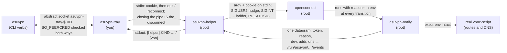
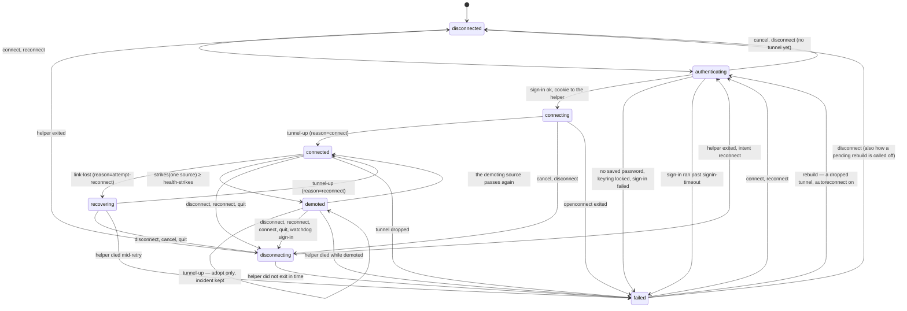
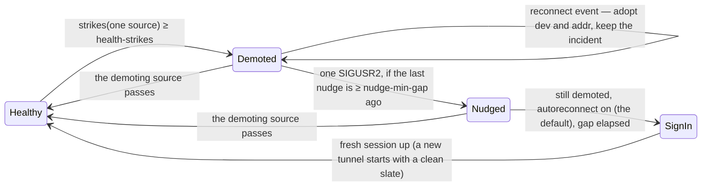

# Design notes

Internals, for anyone reading or changing the code. The
[README](README.md) is the user-facing document; this one assumes you have it
open in another tab and are looking at the source.

One theme runs through the bug history, and it is worth naming before anything
else: **the failures here are things that report success while doing nothing.**
Matching a log line openconnect stopped printing. Chaining to a `vpnc-script`
path that does not exist on this distribution. Comparing whole `argv` elements
when `getopt` bundles short options. `pipx inject` skipping a pin because
*some* `setuptools` was already present, and exiting 0. In every case the exit
status said fine, the code was inert, and nothing noticed until it mattered.

The response is the same each time: **check the effect, not the exit status**,
and prefer asking the installed software over remembering what it does.

The short version of the design: **openconnect must always get to run
`vpnc-script` on the way out.** Almost every unusual decision here — relaying
output instead of sharing a pipe, the control pipe, `PR_SET_PDEATHSIG`, the
single-reaper rule, the generous signal graces — exists because the failure mode
is a machine with no working network until it reboots.

**Contents**

- [The contract](#the-contract)
- [Processes and privilege](#processes-and-privilege)
- [What happens on connect](#what-happens-on-connect)
- [The state machine](#the-state-machine)
- [Where state comes from](#where-state-comes-from)
- [Concurrency](#concurrency)
- [Watching the tunnel](#watching-the-tunnel)
- [Two orderings that are load-bearing](#two-orderings-that-are-load-bearing)
- [Teardown](#teardown)
- [Exit codes](#exit-codes)
- [Invariants](#invariants)
- [How this is tested](#how-this-is-tested)
- [Changing things](#changing-things)

---

## The contract

[`asuvpn_contract.py`](asuvpn_contract.py) holds everything more than one
program has to know: the wire format the helper speaks to the tray, the verbs
the tray speaks back, the fields `asuvpn-notify` puts on the event socket, the
reasons `openconnect` reports, and the settings schema.

It exists because each of those had been restated wherever it was needed, and
most had drifted. Five message prefixes, each parsed by its own string test in
the tray — and one of them keyed on the *wording* "refusing", which four of the
seven refusals it then had did not use, so those reached the user as a bare
exit number. Two
unrelated config mechanisms, a line of text and the presence of a file. Nine
tunables split across two programs with no way for anyone to change them.

| Section | Defines |
| --- | --- |
| Messages | `MESSAGE_PREFIX`, `RELAY_PREFIX`, the five kinds, `encode_message` / `decode_message` / `encode_relay` |
| Control | the verbs the tray writes to the helper's stdin |
| Events | the variable names, the field order, `encode_event` / `decode_event` |
| openconnect | `REASON_STATES`, `INTERFACE_RE` |
| Settings | the schema, the parser, and the generator that writes the file |

### Loaded, not imported

`asuvpn-helper` and `asuvpn-notify` run isolated (`-I`) so that their own
directory is deliberately *not* on `sys.path` — that is what stops a `signal.py`
dropped beside them being executed as root. And `asuvpn-tray` is reached through
a symlink in `~/.local/bin`, so its `sys.path[0]` is that directory rather than
the one its siblings live in. An explicit path built from the resolved location
is the only form correct for all three.

Each program therefore carries a small loader (a dozen lines), and that
duplication is irreducible: code cannot be shared before the mechanism that
shares it has been loaded. It is the only thing in this project stated more
than once on purpose, and one line legitimately differs per program — the tray
resolves with `realpath` because of its symlink, the others use `abspath`; the
reference copy at the foot of `asuvpn_contract.py` says which is which. Every
loader (the selftest's generic sibling loader included) verifies the directory
and the file for write access by a second principal before executing anything
as root; unprivileged runs skip the check, because loading a file you own as
yourself crosses no boundary — and refusing there would break `--link` mode
from an ordinary umask-002 checkout.

### What is executed as root, and what checks it

Four things run or are loaded with privilege: `asuvpn-helper`, its directory,
`asuvpn-notify`, and `asuvpn_contract.py`. The contract joined that set when it
was introduced and was missed by both the helper's runtime list and the
self-test's — the loader checked it, so nothing broke, but a list that
enumerates "the programs I know about" stops covering a new file that runs with
the same privilege. Both lists name all four now.

Verified by tampering rather than by reading: making the contract
world-writable, making its directory world-writable, and replacing it with a
symlink to a writable file are each refused, the last because `os.stat` follows
the link and sees the target. A *shared group* is refused too, end to end: the
sandbox maps this user's `/etc/subgid` block, so `sec.sh` stages a file owned
by a second group and watches the real helper refuse — the loader path for the
contract, and exit 26 for the helper itself. Both assertions are
mutation-verified (neuter either layer and the scenario fails loudly).

### Settings belong to the user side

The helper runs as root, where `~` is root's home. It therefore never reads the
config file: the tray resolves the settings and passes what the helper needs as
explicit arguments (`--dpd`). A privileged process reading a file an
unprivileged account can write is a trust boundary crossed for no reason.

## Processes and privilege

Four programs, two privilege levels.

| Program | Runs as | Lifetime | Owns |
| --- | --- | --- | --- |
| `asuvpn-tray` | you | the desktop session | the UI, the state machine, the CLI, the single-instance socket |
| `asuvpn-helper` | **root**, via `pkexec` | one tunnel | `openconnect`'s lifetime, teardown, the event socket |
| `asuvpn-notify` | **root**, run by `openconnect` | one transition | reporting one event, then chaining to the real `vpnc-script` |
| `asuvpn-selftest` | you | one run | checking the install against the machine |
| `asuvpn_contract.py` | — | loaded by all four | the agreement between them; never executed as a program |

`openconnect-sso` and the Qt browser it opens run **as you**. The only thing
that crosses the privilege boundary is the session cookie, on stdin.

The channels connecting the pieces; everything else in this document rides on
one of them:



The helper does not `exec` and step aside. It stays as `openconnect`'s parent
for the whole tunnel, because being the parent is what makes the control pipe
and `PR_SET_PDEATHSIG` work.

## What happens on connect


The cookie never appears on a command line, so `ps` cannot show it, and it is
never written to the log.

## The state machine

Eight states, one table, one dispatcher. Everything that can happen — a user
verb, a script-contract event, a watchdog verdict, a helper exit — is a
**message**; `StateMachine.dispatch` looks the pair `(current state, message)`
up in the `TRANSITIONS` table at the top of `asuvpn-tray` and runs that row's
handler. Nothing else in the program assigns the state or the incident
bookkeeping. Watchers, workers and log readers only *inject* messages
(`dispatch` on the main loop, `post` from a thread) — the rule that replaced
the scattered hand-written conditionals whose disagreements produced the
worst bugs this project has had: a probe verdict stomping a user's
Disconnect, a timer racing an exit callback into a false FAILED, an
escalation skipping an untried free recovery.

A pair the table does not list is **dropped, and the drop is logged**
(`[tray] ignoring 'check' while disconnecting`) — silence was how late
verdicts once got to act. Every transition happens on the GLib main loop.



The any-state rows are not drawn, to keep the diagram readable: `quit`
works from every state (with a live tunnel it goes through `disconnecting`;
without one the applet just exits), the helper's exit is weighed wherever it
lands (a stale generation is only logged), the helper's informational
messages (device name, fatal or warning sentences) are remembered in any
state, and so is the tray's own failure-scan sentence (`problem` — built
from openconnect's output, not sent by the helper). A `cancel` — or a
`disconnect`, which reaches the same handler — during `authenticating`
normally ends in `disconnected`: the sign-in has no tunnel to tear down.
Rows that stay in place (a fresh address while `connected`, a repeat
link-lost while `recovering`, disconnect while already `disconnected`) are
not drawn either — the `demoted` self-loop is, because adopting without
promoting is the rule the diagram exists to show. And a connect that cannot
even start (no `openconnect-sso` to run) lands straight in `failed`,
skipping `authenticating`.

`RECOVERING` (openconnect re-establishing its own session) and `DEMOTED`
(established but not carrying traffic — the watchdog's verdict) used to hide
inside `connecting` behind a flag; the flag's scattered readers were where
the state bugs lived. Both display as "Connecting…" with their detail line,
exactly as before, so nothing a user sees changed. A `DEMOTED` tunnel is
still an established session: the menu offers Disconnect and Reconnect, and
the table maps `connect` there to a reconnect rather than a silent refusal.
(Making it a real state also surfaced a dead spot: the menu's own Reconnect
on a demoted tunnel used to be silently refused by the busy-state test — the
table row fixed what the flag had hidden.)

### What the menu offers, and why that list

The menu is a view of the table, not a second opinion about it. Every verb
shown in a state has a row for that `(state, message)` pair; a verb with no
row would be a button that logs `ignoring …` and does nothing.

| State | Verbs offered | Why those |
| --- | --- | --- |
| `disconnected`, `failed` | Connect | nothing to tear down |
| `failed`, rebuild owed | Connect, **Stop reconnecting** | something *is* pending, so there has to be a way to call it off that is not "change a setting". The row is `(failed, disconnect)`, which already did exactly this |
| `authenticating`, `connecting` | Cancel | an attempt is in flight and nothing is established yet |
| `recovering` | Cancel | openconnect owns the retry; stopping it is abandoning an attempt, not closing a session |
| `connected`, `demoted` | Disconnect, Reconnect | both are established sessions. Cancel is the wrong word for tearing one down, which is why `demoted` had to become a real state |
| `disconnecting` | none | teardown must not be interrupted, and there is nothing left to cancel |

That last row is why the separator above the verbs is a field rather than a
throwaway: with every verb hidden it sat straight against the next one, two
rules with nothing between them — a menu that looks like it lost its items
rather than one that has none to give. It is now shown and hidden with them.

Labels follow the state where the same row means two different things.
**Stop reconnecting** and **Disconnect** are one item and one handler: in
`failed` there is no tunnel to disconnect, and what the user is stopping is a
sign-in that has not happened yet.

The machine lives in `class StateMachine`, which `VpnTray` inherits. The
split is deliberate: the machine declares the exact surface it needs from
its host (the state fields, and stubs for `log`, `notify`, `_set_state`, the
workers), and `asuvpn selftest` subclasses it with recorded side effects and
drives the very table that ships — plus a check that every table row names a
real handler.

Both state sources — the script contract and the log-matching fallback — send
the *same* `tunnel-up` / `link-lost` messages, so one set of rows serves both
and the two can no longer drift apart (they had, once: one announced a
recovery as a fresh connection and neither said anything when the link
dropped).

The wording distinguishes what a transition costs. *VPN connection lost* and
*VPN reconnecting* are free — same session, no sign-in — while *VPN signing in
again* is the only one that will interrupt the user, so it is the only one
phrased as an action being taken on their behalf.

`failed` is a real state, not an error path: it keeps the last useful sentence
(`last_failure`) so the user is told *why*, and it shows the attention icon.

Two rules the table now makes structural rather than careful:

- **Nothing leaves `disconnecting` except its own teardown's outcome.** The
  rows that can fire there are `helper-exited`, `teardown-finished`,
  `teardown-timeout`, `quit`, and the any-state bookkeeping rows (device,
  fatal, problem, warning — none of which move the state); a late tunnel
  event or watchdog verdict finds no row and is dropped with a log line. (A
  late `reconnect` event once flipped the badge back to `connected`
  mid-teardown, and a probe strike once handed a user's Disconnect to the
  escalation ladder.)
- **`reconnect` stays busy the whole way through.** The teardown carries
  `intent = reconnect`, so the badge goes `disconnecting → authenticating`
  with no momentary gap for `asuvpn reconnect --wait` to mistake for
  completion.

## Where state comes from

Three sources, in strict order of authority.

| Source | Gives | Used |
| --- | --- | --- |
| **Script contract** (`asuvpn-notify` → helper → `[helper] STATE …`) | `reason`, device, assigned address | always, when the channel is up |
| **`/sys/class/net/<dev>/ifindex`** | proof the device is the one we created | teardown ownership only |
| **Log patterns** | a guess | fallback only, disabled the moment a real event arrives |

`openconnect` runs `vpnc-script` at every transition with the state in the
environment. The mapping the helper applies:

| `reason` | Tray state | What you see |
| --- | --- | --- |
| `pre-init` | *(none)* | nothing — the tunnel is not configured yet |
| `connect` | `connected` | **Connected — 10.x.x.x** |
| `attempt-reconnect` | `recovering` | **Connecting… — link lost, retrying** |
| `reconnect` | `connected` | **Connected — 10.x.x.x** (address may have changed) |
| `disconnect` | *(deferred)* | left to the exit path, which knows whether you asked for it |

The wire itself carries only the contract's three words — `connected`,
`connecting`, `disconnected` (`STATE_*` in the contract). Which of the eight
machine states results depends on the state the word arrives in — that is
the transition table's job, and this table shows the healthy path: the same
`connected` word that promotes a `recovering` tunnel only *adopts* on a
`demoted` one.

### Why the contract and not the log

The log wording is not an interface. `openconnect` renamed its success line to
`Configured as …` in v8, and v9.12 contains no `Connected as` string at all — so
matching on that meant the applet could only reach `connected` when DTLS
happened to negotiate. On a network blocking UDP/443, the tunnel worked while
the tray sat in "Connecting…" forever.

The five `reason` values are inherited from vpnc, documented, and unchanged
across that rename. They are present in the installed binary — `connect` and
`reconnect` do not show up in `strings` output only because the linker
tail-merges them into `attempt-reconnect`:

```
attempt-reconnect  0x7420a
      reconnect    0x74212   = 0x7420a + 8
        connect    0x74214   = 0x74212 + 2
```

and the installed `/usr/share/vpnc-scripts/vpnc-script` enumerates exactly those
five in its own `case "$reason"` statement.

### Chaining, and why the script path is derived

Passing `--script` **replaces** openconnect's compiled-in default. That path
differs by distribution — `/usr/share/vpnc-scripts/vpnc-script` on Debian and
Ubuntu, `/etc/vpnc/vpnc-script` on Fedora and Arch, anything in a source build —
so it is read from `openconnect --version`, which reports it, rather than
assumed. Hardcoding it is the same mistake as hardcoding log text, with a worse
outcome: chain to a path that is not there and `sh` returns 127, `openconnect`
logs `Script … returned error 127` and carries on, and the tunnel comes up with
no routes and no DNS while the tray shows **Connected**.

If the resolved script is missing or not executable, the helper **does not
interpose at all** — no `--script` is passed, openconnect keeps its own default,
and state falls back to log matching. Losing state precision is a fair trade;
losing the routing table is not.

### Framing

`openconnect`'s output and the helper's own messages share one pipe, so
everything from `openconnect` is prefixed `[vpn] ` and only `[helper] ` lines
are trusted. Without that, a VPN banner containing `[helper] WARNING:` could
raise a desktop notification with text the server chose, and
`[helper] STATE connected` could drive the badge.

Two smaller rules fall out of the same idea, both enforced where the line is
*built* rather than trusted from the sender:

- a device name that could not name a device is rejected, because it is about
  to become a path component under `/sys/class/net`;
- every field is collapsed to a single whitespace-free token, because a newline
  would end the line early and a **space** would silently add a second `addr=`
  — and parsing keeps the last one.

## Concurrency

### asuvpn-tray

The GLib main loop owns all state and all GTK. Everything else posts to it.

| Thread | Job | Notes |
| --- | --- | --- |
| main loop | state, UI, every transition | worker threads reach it only via `GLib.idle_add` |
| `_auth_thread` | runs `openconnect-sso`, parses HOST/COOKIE/FINGERPRINT | holds its `Popen` in a local, never re-reads `self.auth_proc` |
| `_pump` | drains sign-in stderr into the log | |
| `_tunnel_thread` | reads the helper's output, then reaps it | the **only** caller of `helper.wait()` |
| teardown workers | `_disconnect_thread`, `_reconnect_thread`, `_cancel_tunnel_thread`, `_quit_thread` | wait on an `Event`, never on `wait()` |
| probe worker | one TCP connect through the tunnel | spawned per probe; replies via `idle_add`, and `probe_in_flight` keeps them from stacking |
| IPC loop | accepts CLI connections, checks `SO_PEERCRED` | runs actions on the main loop and waits for them |

| Lock / primitive | Protects |
| --- | --- |
| `_log_lock` | the in-memory log tail and the log file |
| `_stdin_lock` | the helper's stdin, and the `(helper_proc, helper_exited)` pair — published together so a teardown cannot pair one generation's pipe with another's event |
| `_auth_lock` | the sign-in `Popen` handle, read exactly once |
| `helper_exited` (Event) | how teardown waits, instead of a second `wait()` |
| `_status` (tuple) | state and detail published as one object, so the IPC thread cannot read a new state beside an old detail |

`asuvpn-tray` is one file; its section markers are a working map:

| Marker in the file | Owns |
| --- | --- |
| `menu` | menu construction and the visibility rules per state |
| `log` | the scrubber, the in-memory tail, the file writer, rotation, the log window |
| `actions` | connect / disconnect / reconnect / cancel / quit |
| `phase 1: auth` | `openconnect-sso`, the keyring probe, the blank TOTP answer |
| `phase 2: tunnel` | the pkexec spawn, the reader thread, state events |
| `watchdog` | adoption, health checks, the probe, the demotion ladder |
| `teardown` | closing the control pipe, waiting, failure reporting |
| `autostart` | the login `.desktop` entry |
| `single instance IPC` | the abstract socket, peer checks, verb dispatch |
| `command line` | argparse, the verbs, the exit codes |

**Generation counters.** `helper_generation` and `auth_generation` are bumped on
every new tunnel and every new sign-in. A helper that is still dying must not be
able to report its exit over the top of its replacement — that would drop the
tray's only handle on a live root `openconnect`. Likewise a sign-in still in
flight must not start a tunnel on top of a newer one; `cancelled` alone is not
enough, because a new connect clears it.

### asuvpn-helper

| Thread | Job |
| --- | --- |
| main | parks in `Tunnel.reap()` — the **only** caller of `Popen.wait()` |
| `serve_events` | reads the datagram socket, emits `[helper] STATE …` |
| `watch_for_interface` | polls `/sys` for our device's ifindex, as a second source |
| `relay_output` | forwards `openconnect`'s output, prefixed |
| `watch_control_channel` | reads stdin; `quit` or EOF starts teardown |
| signal handler | spawns a `shutdown` worker — it runs on the main thread, which is parked |

### The one-reaper rule

CPython keeps a per-process `_waitpid_lock`. A **timed** wait acquires it
non-blockingly, so if another thread is already parked in a blocking
`Popen.wait()`, every timed wait times out no matter how fast the child exits.

This was not academic. A clean teardown looked like a hang and escalated all the
way to `SIGKILL` — which is precisely the thing that stops `vpnc-script` from
restoring the routing table. Hence: exactly one thread calls `wait()` per child,
and everyone else waits on an `Event`.

`preexec_fn` is used once, in the helper, and is safe only because the helper
has started no threads at that point. `parent_pid` is captured **before** the
`Popen`, because `preexec_fn` runs in the child and `os.getpid()` there returns
the child's own pid — which made the guard fire every time and killed
`openconnect` before it started.

## Watching the tunnel

### Why anything is needed

`openconnect` re-establishes the tunnel on its own when dead peer detection
fails, reusing the session cookie. That path is free — no sign-in, no Duo, no
polkit — and the applet should stay out of its way.

Two things defeat it, and both produce the same symptom: everything reports
connected and nothing flows.

**The server turns DPD off.** ASU negotiates `CSTP connected. DPD 0, Keepalive
0`. With no probes and no keepalives there is no mechanism to notice the far end
stopped answering, so `openconnect` waits forever. The helper therefore passes
`--force-dpd 30`, documented as using DPD "even if the server hasn't requested
it". Getting the interval wrong is cheap — a DPD failure re-establishes with the
same cookie — so this errs toward checking.

**The break is local.** A resume from suspend, a network change, or another
daemon rewriting the routing table can leave the socket healthy while the routes
that make the tunnel useful are gone. DPD passes, because the far end really is
answering. Nothing below the applet can see this.

### What is checked, and what is deliberately not

Every check runs on the GLib main loop every `health-interval` seconds (a
setting, like every tunable in this section) and is a couple of reads from
`/sys` and `/proc` — no packets, no subprocess. Two consecutive bad checks are
required (`health-strikes`), because routes are briefly absent while
`openconnect` reinstalls them during a legitimate reconnect.

Three of the four checks that suggest themselves first are **wrong**, and each
was tried against a live ASU tunnel before being discarded:

| Rejected check | Value on a healthy ASU tunnel |
| --- | --- |
| `operstate == "up"` | `unknown` — tun devices never report `up` |
| `IFF_RUNNING` (`0x40`) | clear; flags are `0x1091` |
| a default route via the device | absent — split tunnel, 53 IPv4 + 6 IPv6 routes and the default stays on WiFi |
| counters advancing | flat; an idle tunnel moves nothing |

What survives is true of every working tunnel and false of a broken one:

| Verdict | Meaning |
| --- | --- |
| `the tunnel device is gone` | `/sys/class/net/<dev>` no longer exists |
| `the tunnel device was replaced by a different one` | the name is back but the `ifindex` is not the one this session created |
| `the tunnel device is down` | `IFF_UP` clear |
| `no routes point at the tunnel any more` | zero routes in every family that could be read, and at least one could. Not `v4 == 0 and v6 == 0`, which looks like the same test: a kernel built without IPv6 has no `/proc/net/ipv6_route`, so that count is *unreadable* rather than zero and the comparison stayed false through an empty table. Unreadable is still never evidence of a fault. The case DPD cannot see |
| `the tunnel's IPv4 routes are gone` / `…IPv6…` | a family the tunnel was observed to have, wholly gone — `ip route flush dev X` removes only IPv4, and a summed count sat green through exactly that break on a live tunnel (2026-08-23) |

Every failing check and every recovery carries its facts into the log — a
quietly healthy check logs nothing, because a line every twenty seconds
forever would bury the log — so the next silent break arrives with evidence
attached rather than as a mystery.

Five words this section leans on: a **source** is one of the two independent
judges, `device` (kernel facts) or `probe` (a packet); a **strike** is one
failing check from one source; a **demotion** takes the badge out of Connected
after `health-strikes` consecutive strikes from a single source; an
**incident** is one demotion, lasting until the *demoting* source passes
again; the **nudge** is the free `SIGUSR2` re-establish, spent once per
incident.

### The probe, for the blind spot they share

All of the above can pass while the tunnel carries nothing. So every
`probe-every` cycles the applet opens a TCP connection through the tunnel and
closes it, on a worker thread — `probe-timeout` seconds on the GLib main loop
would freeze the UI.

The target is derived by default, never hardcoded: `INTERNAL_IP4_DNS`,
forwarded from `asuvpn-notify` through the same script contract as everything
else. Whatever this tunnel says to resolve against ought to answer through
it. The `probe-target` setting overrides the derivation for the rare network
where the pushed resolver is not the right thing to ask.

**A refusal counts as alive.** Measured against a live ASU tunnel, one pushed
resolver completed the handshake in 29ms and the other answered with a RST in
20ms; both prove a packet crossed in each direction. Only a timeout means the
tunnel is black-holed, and `ENETUNREACH`-style errors return *inconclusive*
because the device checks already diagnose that better.

| Outcome | Verdict |
| --- | --- |
| connected | alive |
| `ConnectionRefusedError` | alive — a RST is a reply |
| timeout | **not carrying traffic** |
| other `OSError` | inconclusive; the device checks own it |

The two sources keep separate strike counters, and a demotion is only undone by
the source that caused it. Sharing one counter would let the device check —
which still passes perfectly during a black hole — promote the badge back every
twenty seconds and flap it indefinitely.

That rule holds against openconnect's own word too. The `reconnect` event a
nudge produces adopts the tunnel — address, device, ifindex — but does **not**
promote the badge or reset the incident: openconnect asserting "connected" is
exactly what it asserted before the demoting source found otherwise, and the
source's own next pass (at most one probe cycle away) is what promotes.
Taking the event's word flapped the badge every two minutes against a live
tunnel whose routes were gone, refired the once-per-incident notification each
cycle, and kept the sign-in branch permanently out of reach.

### Escalating, cheapest first

The two recoveries differ by a Duo push and a typed password, so they are not
interchangeable:

| Step | Cost | Rate limit |
| --- | --- | --- |
| `SIGUSR2` to `openconnect` via the control pipe | none — same session | once per incident; `nudge-min-gap`, default 120s, between incidents |
| stay demoted, say the free option is spent | none | once per incident |
| full sign-in (`reconnect`) | Duo approval **and** polkit password | `autoreconnect-min-gap`, default 300s; on by default, and one untick from off |



These are positions within one incident, not machine states: `Demoted` and
`Nudged` are both the machine's `DEMOTED` (the nudge is bookkeeping inside
it), and `SignIn` runs `disconnecting → authenticating → connecting` like
any other reconnect — the fresh tunnel's `tunnel-up` promotes it, because a
new tunnel begins with no incident to clear.

### When the tunnel is gone, not merely useless

The ladder above escalates a tunnel that is **up** and useless. A tunnel that
is **gone** cannot enter it at all — there is no helper to nudge, no device to
watch, no check to strike — so for a long time `autoreconnect` did nothing
whatever for the most ordinary break there is. `openconnect` gives up after
its own `--reconnect-timeout` (300s by default), which any suspend or WiFi
outage longer than that produces; the applet landed on `failed` and stayed
there until somebody came back and clicked Connect, with the setting that
promises otherwise switched on.

The `(failed, rebuild)` row closes that. It is driven by the health tick,
because `failed` has no events of its own and there is no other timer, and
three separate bounds are what make retrying safe rather than rude:

| Bound | What it answers |
| --- | --- |
| `dropped`, armed only by an exit that followed real traffic | a rejected cookie, a dismissed authorization or an unmatched certificate pin will do the same thing the second time — so they are never retried, and every rebuild has to re-earn the flag the same way |
| `autoreconnect-min-gap`, shared with the ladder | the two automatic sign-ins cannot add up to more than the user allowed |
| `MAX_REBUILDS`, three | a network that is down stays down, and spacing alone would keep opening browser windows all afternoon |

The setting is read **at the drop** to arm it, and again before each attempt.
Those two are not the same reading on purpose: a box ticked hours after a
tunnel died should not open a browser window for it, while one unticked
mid-retry should stop the next one. Acting on the newer answer is right in
exactly the direction where it means doing less.

Two pieces of bookkeeping carry this, and they are cleared by different
things — which is the part that took two attempts to get right:

| Event | Flag (`dropped`) | Count (`rebuilds`) | Why |
| --- | --- | --- | --- |
| Connect, Disconnect, Cancel | cleared | cleared | a human took over; nothing may keep retrying behind them |
| Reconnect | — | — | `_tr_teardown_reconnect` is shared with the ladder, and clearing from there would let a demotion sign-in refund the drop budget every time round. Nothing is lost: the last row refunds it anyway |
| the setting turned off | cleared | — | disarmed, not paused. Left armed, ticking the box again hours later opened a browser window for a tunnel that died before lunch |
| `MAX_REBUILDS` reached | cleared | — | said once, and the badge stops promising a rebuild that is not coming |
| reaching `connected` | cleared | **kept** | there is a tunnel, so nothing is owed — but every rebuild reaches this line, including the ones whose tunnel falls over seconds later |
| a session outliving the gap, judged at its death | — | cleared | it did not flap, so whatever produced it worked |

That last pair is the load-bearing one. Refunding the count at `connected`
instead — which is where it obviously belongs, and where it first went — made
`MAX_REBUILDS` unreachable against exactly the flap it exists for: connect,
die, connect, die, one Duo push per gap forever. A tunnel has to *last* to
earn its attempts back, and how long is already written down as
`autoreconnect-min-gap`.

Calling one off from the panel needed nothing new in the machine. The
`(failed, disconnect)` row already cleared both and settled on `disconnected`
— it is how `asuvpn disconnect` has always stopped a rebuild — the menu
simply never offered the verb in that state, so the only way to stop one was
to untick a setting the user may want kept. The item is now shown while a
rebuild is owed, labelled **Stop reconnecting**: "Disconnect" is the wrong
word for a tunnel that is already gone, and what is being stopped is a
sign-in that has not happened yet.

The three ways a rebuild is called off without a state change of its own all
go through `_disarm`, which rewrites only the badge's trailing promise and
keeps the failure that caused it. Outside the log that detail is the only
record of *why*, and it reaches `asuvpn status` as well as the panel.

### The sign-in has to end

`openconnect-sso` opens a browser window and blocks on a Duo approval. Run
from the menu that is fine — somebody is looking at it. Run from a rebuild it
is not: with nobody at the keyboard it blocks for as long as the applet
lives, the badge sits at `authenticating`, the watchdog does not run in that
state, and only Cancel clears it. So `signin-timeout` (300s, held to
60–3600, deliberately with no off) kills the sign-in's process group exactly
the way Cancel does, and the blocking read of its stdout ends on the closed
pipe — a read that cannot be given a timeout of its own. The attempt is then
reported as `sign-in did not finish within Ns`, named for what happened
rather than for the signal it died of.

The waiting itself lives in a module-level `Deadline`, with the kill passed
in, for the same reason `parse_state_payload` sits at module level: the
failure it exists to prevent is a wait that never returns, and no test can
observe that by waiting for it. `asuvpn selftest` drives it against a real
child that would outlive the whole run, so a deadline that stopped firing
hangs the suite rather than passing quietly.

A nudge merely *held* by its gap keeps the incident in Demoted — the ladder
waits it out rather than escalating past it, because jumping to a sign-in
while the log says "holding the free re-establish" would buy with a Duo push
what a sub-two-minute wait gets for free.

The nudge travels down the **existing** control pipe, so it needs no new
privileged call — the helper is already root and already listening. It is
spent once per incident, with the timestamp guarding incidents that arrive
back to back. An earlier design used the timestamp alone, reasoning that a
per-incident flag would reset itself on the `reconnect` event each nudge
produces — which was true right up until the incident stopped resetting on
that event (see above): now "already nudged and still demoted" is precisely
the evidence the nudge cannot fix this break, and asking again every two
minutes was the loop a routes-lost tunnel actually exhibited.

Three details that are easy to get wrong, and were:

- **The log is not truncated on an automatic reconnect.** Connecting normally
  starts a fresh log, which is right when a person asked for one. It is wrong
  when the applet reconnected by itself: the lines explaining *why* are the only
  record of a breakage that was silent by definition, and wiping them leaves a
  fresh log saying nothing happened.
- **The rate-limit timestamps survive a reconnect.** Every automatic recovery
  arrives back through `_act_start_tunnel`, so resetting them there — which an
  earlier version did — cleared the limits on every cycle and let a tunnel that
  kept breaking take a `SIGUSR2` or a Duo push each time round.
- **A demoted tunnel is still an established one.** It has a helper and a
  device, so the menu offers Disconnect and Reconnect rather than Cancel, and
  `disconnect` tears it down instead of taking the abandon-the-attempt path.
  The CLI's `connect` delegates to `reconnect` there for the same reason —
  refusing silently, as a plain busy state does, read as "cannot connect"
  against a live demoted tunnel. Keying any of this purely on `CONNECTED`
  gets it wrong.

Every pass through the ladder logs the decision it took and the reason — the
nudge held and for how long, the free option already spent, sign-in off, or
sign-in waiting out its gap. A log that shows verdicts but not decisions reads
as a hang, which is how the first live routes-lost break read.

Teardown always outranks the watchdog: `disconnecting` has no row for a
verdict or for a reconnect, so nothing the ladder decides can interrupt a
disconnect or quit already under way.

Automatic sign-in is on by default and turned off via the menu or
`asuvpn autoreconnect off` — both edit the `autoreconnect` line of
`asuvpn.conf` in place. It is defaulted on rather than opt-in because of
*where it sits*: the rung is reached only once the free re-establish has been
spent on this incident and the tunnel is still carrying nothing, which is the
point at which the only remaining recovery is a human at the keyboard. What
the setting decides is whether the applet may spend a Duo push to avoid
needing one; turning it off stops at the demotion instead, which is a real
preference and stays one line away. The watchdog re-reads that file on every check, so a
running applet picks up the change without any message passing, and the menu
checkbox follows the file rather than its own memory. (An earlier mechanism
used the presence of a marker file; `install.sh` still deletes the leftover.)

## Two orderings that are load-bearing

**The exit message is posted before the event that releases teardown.** In
`_tunnel_thread`'s `finally`, `post(helper-exited)` comes before
`exited.set()`. The reconnect worker wakes on that event and posts
`teardown-finished`; with the old order it could win the race, so the exit
would be weighed *after* the reconnect had already begun, and a perfectly
healthy recovery would be reported as a failure.

**What the tunnel was is read before it is forgotten.** The `helper-exited`
row captures `was_connected` before `_reset_tunnel_state()`, because a
DEMOTED tunnel is no longer in `CONNECTED` but certainly was one, and
"connection dropped" explains its death better than an exit status does.

There is exactly one `_reset_tunnel_state()`, with four callers: `__init__`,
the tunnel starter, the `helper-exited` row, and the dead-helper branch of
the reconnect row. It was open-coded in three places and had already
diverged: the tunnel starter's copy omitted `tunnel_dns`, so a new tunnel
kept probing the *previous* one's resolver — an address with no reason to be
reachable through it. The incident half of it (`_clear_incident`) is shared
with mid-session adoption for the same reason.

## Teardown

Closing the control pipe **is** the disconnect signal. The tray holds the write
end, so disconnecting needs no second polkit prompt, and a crashed tray cannot
strand a root process.

The escalation ladder, deliberately generous:

| Signal | Grace | Runs `vpnc-script`? |
| --- | --- | --- |
| `SIGINT` | 15 s | yes |
| `SIGTERM` | 10 s | yes |
| `SIGKILL` | 5 s | **no** |

`teardown-timeout` defaults to 75 s so the tray outlasts the whole ladder plus
draining output and checking the routing table; the schema refuses values
below 35, because a wait shorter than the ladder reports every clean
disconnect as a failure while the helper is still fine.

Three independent guards, each covering a different death:

| What dies | What catches it |
| --- | --- |
| the tray (crash, `kill -9`, log out) | the control pipe closes; the helper sees EOF and tears down |
| the helper (OOM, `kill -9`) | `PR_SET_PDEATHSIG` makes the kernel send `openconnect` a `SIGINT` |
| `openconnect` itself | the helper reaps it, then deletes a leftover device and re-checks the default route |

Output is **relayed** rather than handed straight to the tray's pipe. That costs
a thread, but a dead tray can otherwise hit `openconnect` with `SIGPIPE` and
kill it *before* it restores routing.

Only *our* device is ever deleted, identified by the ifindex captured when
`openconnect` created it — not by name. Two helpers can race for the free name
`asuvpn0`; the loser must not delete the winner's live tunnel.

## Exit codes

### `asuvpn` (the CLI)

| Code | Meaning |
| --- | --- |
| `0` | the request was carried out; for `status` and `--wait`, connected |
| `1` | `status`/`--wait`: not connected. `disconnect`: the tunnel did not close. `quit`: still shutting down. `log`: no log yet |
| `2` | bad command line (argparse's own code) |
| `3` | `status` — or a `--wait` the applet vanished under: it is not running |
| `4` | a different server was asked for than the running applet is using |

### `asuvpn-helper`

These reach you as the tunnel's exit status. The helper emits each with a
`[helper] FATAL ` marker and the tray shows that sentence as the failure detail
instead of the number. The marker replaced a test for lines beginning with
"refusing", which four of the seven refusals it then had did not — so those
reached the user as a bare status code with the explanation sitting unread in
the log. Wording is not an interface, here either.

| Code | Meaning |
| --- | --- |
| `20` | `openconnect` is not installed |
| `21` | no session cookie arrived on stdin |
| `22` | the requested interface name could not name a device |
| `23` | the requested interface already exists; refusing to take over a device we did not create |
| `24` | no free `asuvpnN` name |
| `25` | an option was passed that would detach `openconnect` from the helper (`--background`, `--syslog`, `--pid-file`, or a bundled short option) |
| `26` | the helper, its directory, `asuvpn-notify` or `asuvpn_contract.py` is writable by another principal |
| `27` | a negative dead-peer interval reached the helper; the config parser cannot produce one, so it came from a direct caller |
| other | `openconnect`'s own exit status; `128 + n` if it was killed by signal *n* |

### `asuvpn-selftest`

`0` if nothing failed, `1` otherwise. Warnings do not fail the run.

## Invariants

The properties the code exists to maintain. Each is enforced somewhere and,
where it can be, checked by `asuvpn selftest`.

| Invariant | Enforced by | Checked by |
| --- | --- | --- |
| `openconnect` always gets to run `vpnc-script` on the way out | escalation ladder, output relay, `PR_SET_PDEATHSIG` | teardown scenarios in the sandbox; `stubborn.sh` asserts the ladder's *order* against a peer that ignores `SIGINT` — `SIGTERM` only after the grace, `SIGKILL` not at all |
| No root process outlives the tray | control pipe, `PR_SET_PDEATHSIG`, no `--background` | `SIGKILL` the tray and look for survivors; `pdeath.sh` SIGKILLs the *helper* and asserts openconnect died with it |
| Only a device this session created is ever deleted | ifindex ownership, free-name selection | `--interface <existing>` is refused (exit 23, wiring tier), and the logic tier drives `verify_teardown` both ways: a foreign ifindex is left alone, our own is deleted |
| A device name never reaches the filesystem or `ip` unvalidated | `INTERFACE_RE`, checked at both ends — where produced and where consumed | logic + wiring tiers, with traversal and whitespace payloads |
| `openconnect` cannot forge a helper message | `[vpn] ` prefix on every relayed line | logic tier, with `\r` and `\n` payloads |
| A state event cannot inject a line or a field | reject impossible device names; collapse every field to one token | wiring tier, with space-and-`=` payloads |
| Only this user can drive the applet, and only this user's applet answers | `SO_PEERCRED` at both ends, failing closed | `ipc-gate.sh` stages a real second uid: refused with no reply, logged with the uid — and the same poke from our own uid answered, so the refusal is not vacuous |
| The cookie never reaches a command line or the log | `--cookie-on-stdin` only | grep the log and the journal |
| Interposing never costs routing | derive the script, step aside if unusable | environment tier |
| A stalled tunnel is noticed rather than shown as connected | `--force-dpd`, plus a watchdog for what DPD cannot see | logic tier, and a sandbox scenario where the device never appears |
| A tunnel that dies unattended is rebuilt, and a retry never becomes a loop | armed only by an exit that followed real traffic, capped at `MAX_REBUILDS`, sharing the ladder's rate limit | logic tier drives all three bounds on the shipping table, both directions of the setting included |
| A sign-in always ends | `signin-timeout` kills the process group; the blocking read ends on the closed pipe | logic tier; the setting has no off, so the guarantee has no hole |
| Recovery never costs a Duo push while a free option remains | `SIGUSR2` first — waited for if rate-limited, never skipped — the sign-in rung is unreachable until the nudge is spent | `escalate.sh` **asserts** exactly one nudge and one sign-in over 115s; the held-nudge rule in the logic tier |
| openconnect cannot drive the control channel | it is spawned with its own `stdin` pipe | `fdcheck.sh` asserts `/proc/<pid>/fd/0` of the two are distinct (the child's open mode is printed for the reader) |
| A refusal is reported as a sentence, not a number | `[helper] FATAL ` marker, set by the helper | wiring tier, by running three refused connects |
| Everything executed as root is unwritable by a second principal | every loader's bootstrap check, the helper's runtime list (exit 26), `install.sh`'s `go-w` sweep | environment tier, by making each file writable in turn, and end to end for a shared group in the sandbox (`sec.sh` b/b2) |
| `openconnect-sso` can still import `pkg_resources` | `setuptools<71` pinned with `pipx inject --force` | environment tier, by importing it |

## How this is tested

Three tiers in `asuvpn-selftest` (124 checks), plus the scenario sandbox in
[tests/sandbox](tests/sandbox/README.md).

The shaping constraint: **conventional unit tests would not have caught any of
the bugs that actually hurt this project.** `Connected as`, the hardcoded script
path, `getopt` bundling — every one was a wrong assumption about the
*environment*, and a test checking the code against itself would have passed
while the code was dead. So the `environment` tier reads the installed
`libopenconnect`'s own string table and the installed `vpnc-script`'s own `case`
statement, and asks the binary for its default script path.

### The sandbox

Scenario tests live in [tests/sandbox](tests/sandbox/README.md) and run inside
an **unprivileged user + mount namespace**, with fakes bind-mounted over
`/usr/sbin/openconnect`, `/usr/bin/pkexec`, the real `openconnect-sso`, and the
`vpnc-script`. A guard refuses to start unless every one of them resolves to a
fake. The namespace also maps this user's `/etc/subgid` block, so a file owned
by a *second group* can be staged inside it — which is what lets the
shared-group refusal run end to end instead of only as a predicate truth table.

This replaced an arrangement based on symlinks, which twice let a test reach a
real binary — once opening the real ASU sign-in browser. A namespace cannot leak
that way: the real filesystem is never modified, and is byte-identical
afterwards.

The stand-in `openconnect` prints only lines that are either prefixed
`[stand-in] ` (harness telemetry, which no real line begins with) or copied
from the installed binary's catalogue, and it invokes `--script` the way the
real one does, so the contract is exercised rather than mocked around.
`asuvpn selftest` enforces the wording rule mechanically.

Every scenario asserts its outcome and exits 1 when it is not met — a
scenario that only prints proves nothing, and six of them once did exactly
that: their tray-readiness loop had never succeeded even once (`asuvpn
status` exits 1 while up-but-disconnected, and the loop tested for 0), and
the long sleeps that followed hid it. The readiness probe now treats any
answer but "not running" as up, and failing to come up at all fails the
scenario loudly, with the tray's stderr attached.

### Mutation testing

A suite that only ever passes proves nothing, so the checks are verified by
breaking the code on purpose:

| Mutation | Caught by |
| --- | --- |
| revert the bundled-short-option refusal | supervision-breaking options |
| make the field sanitiser a no-op | no event can emit more than one line |
| make the sanitiser leave spaces | no event can inject an extra field |
| drop the device-name validation | impossible device names are rejected |
| accept any event token | malformed events are discarded |
| stop scrubbing the token before the chained script | token is scrubbed |
| point the default script somewhere absent | default `vpnc-script` is executable |
| match on a message the binary no longer contains | fallback patterns still match |
| make the install directory world-writable | nothing run as root is writable |
| a `vpnc-script` with `case` branches missing two reasons | the default script handles every reason |
| an `openconnect-sso` venv without `pkg_resources` | `openconnect-sso` can import `pkg_resources` |
| teach the stand-in an invented line (`Connected as …`) | the stand-in only speaks lines from the installed catalogue |
| weaken the log scrubber back to colour codes only | hostile control sequences never reach the log |
| sum the route families again instead of counting each | a route family the tunnel had, wholly gone, is a verdict |
| test `v4 == 0 and v6 == 0` again, so an unreadable family hides an empty table | an empty table is a verdict even where IPv6 cannot be read |
| refund the rebuild count when a tunnel merely reaches connected | a flapping tunnel cannot outrun the rebuild limit |
| arm the rebuild on any exit, not only one that followed real traffic | a tunnel that never came up is not rebuilt |
| delete the `(failed, rebuild)` row | no handler is orphaned by the table, plus every rebuild check |
| drop `_clear_drop` from the cancel row | cancelling a rebuild hands the whole budget back |
| let `signin-timeout` accept 0, or any value at all | signin-timeout has no off, and no nonsense either |
| let the deadline watcher return without killing | a sign-in that never finishes is ended, not waited on |
| let the reconnect event promote a demoted badge | a reconnect event mid-demotion adopts the tunnel but not the badge |
| let a mid-demotion adoption reset the incident flags | an incident takes one nudge, then says the free option is spent |
| allow re-nudging within one incident | the same check — after winding the clock past the rate limit, so the flag and not the timestamp is what refuses |
| empty the demoted-connect handler so the verb is refused again | connect on a demoted tunnel means reconnect, and only there |
| reword the declined-action log line | a cycle that declines to act logs its decision and its reason |
| drop the rotation shift so `.1` is clobbered | the log rotates, keeps log-keep files, and starts fresh |
| neuter the contract's shared-group predicate | `sec.sh` (b2): the helper no longer exits 26 |
| neuter the loader's inline check as well | `sec.sh` (b): a group-shared contract executes |
| compare the event token as text again (crashes on non-ASCII) | unauthenticated and malformed events are discarded |
| make the output relay a no-op | every relayed line is exactly one line, and none was dropped |
| stop stripping comments from config lines | the generated config file parses back to the defaults, cleanly |
| un-wire the scrubber from the log's write path | the log file receives scrubbed lines only, and is born 0600 |
| create the log file with umask permissions | the same check, its 0600 half |
| let the scrubber pass C1 controls again | hostile control sequences never reach the log |
| let any source promote another source's demotion | a source that did not demote cannot promote |
| let the once-per-incident warning repeat | an incident takes one nudge, then says the free option is spent |
| escalate past a nudge that was only rate-limited | a held nudge is waited out, never escalated past |
| keep the old device's route families across a replacement | a replaced device forgets the old one's route families |
| let a probe verdict act during teardown | a probe verdict arriving mid-teardown changes nothing |
| let a probe exception escape its thread | an unusable probe target is inconclusive — and the harness records a crashed check as its own failure |
| delete the demoted-connect row from the table | connect on a demoted tunnel means reconnect, and only there |
| delete or repoint the mid-demotion event row | a reconnect event mid-demotion adopts the tunnel but not the badge |
| point a table row at a handler that does not exist | every transition row names a real handler |
| delete a row while its handler survives | no handler is orphaned by the table |
| drop the teardown-timeout floor from the schema | a teardown-timeout below the signal escalation is refused |
| stop scrubbing the captured failure sentence | a failure sentence is scrubbed before it becomes the detail |
| drop DEMOTED from the fallback scan gate | a fallback tunnel-up mid-demotion adopts but does not promote |
| let an addr-less line blank a known address | an addr-less fallback line does not blank a known address |
| drift the installers' hand-copied server default | the shell installers' server default matches the schema |
| count the log's size meter in characters again | the log-write-path check, its size-meter half |
| return the first `--force-dpd` instead of the last | the last `--force-dpd` wins, like every other option reader |
| drop the badge's rebuilding suffix from a failed sign-in | a failed rebuild attempt keeps the badge's promise |
| drop the suffix from a sign-in that cannot even start | a rebuild's failed start keeps the badge's promise |
| delete the stale-attempt guard on the sign-in's success row | a superseded sign-in cannot start a tunnel |
| delete the stale-attempt guard on its failure row | a superseded failure report changes nothing either |
| let a clear leave the strike count standing | a clear resets the strike count; blips do not accumulate |
| gate the failure scan behind the event latch again | a failure sentence is scrubbed — driven with events latched |
| map every helper message to NOTE, warnings included | a deliberate event-channel close is silent (its kind-counting half) |
| silence the no-default-route warning after teardown | a teardown that left no default route says so |
| drop the `preexec_fn` that arms the parent-death signal | `pdeath.sh`: openconnect outlived its dead helper |
| drop `asuvpn-notify` from the helper's refusal tuple | `sec.sh` (e2): a world-writable notify executed |
| drop the reconnect verb from the control channel | `watchdog-test.sh`: the nudge was logged but never delivered |
| revert the interface regex to `$`, so a trailing newline passes | unusable interface names are rejected (twice: the name lists, and the health-path leak check) |
| drop the probe-port floor from the schema | settings parse by type, and the problems count |
| widen the config regeneration back to every read error | one setting changes; the rest of the file is the user's |
| re-add a momentary DISCONNECTED to the reconnect handoff (both sites) | the teardown-to-sign-in handoff publishes no state of its own |
| neuter the RECOVERING stand-aside | a verdict during openconnect's own recovery is set aside |
| flip the ifindex comparison before root's `ip link delete` | only the device this session created is ever deleted |
| neuter the existing-interface refusal | a refused connect explains itself (the exit-23 case — with the refusal gone, the real openconnect actually ran) |
| refuse the negative dpd only after the event channel opens | `sec3.sh`: the refusal leaked a session channel |
| put `SIGKILL` first in the escalation ladder | `stubborn.sh`: exited 137 instead of walking the ladder |
| weaken the IPC gate to accept any readable peer | `ipc-gate.sh`: a foreign uid read the applet's state |
| break the helper-exited reconnect intent | `escalate.sh`: the announced sign-in never started a second tunnel |
| invert the closing flag's test, either direction | a deliberate event-channel close is silent; a surprise one warns |

The fallback-patterns row is the one that matters most: it is the check that
would have caught the original `Connected as` failure, and the stand-in row
closes the same hole from the test side — a fake can no longer drift into
wording the real binary cannot say.

### Not crying wolf

A check that reports a failure it cannot actually establish teaches people to
ignore the whole suite, so where certainty is not available the result is a
warning that says as much. The `vpnc-script` check is the example: the stock
script dispatches with `case "$reason" in`, but a custom one written with
`if [ "$reason" = connect ]` is equally valid and unparseable by us. So it
reports **ok** when every branch is found, **fail** when the script clearly
dispatches on `$reason` but skips some, and **warn** when it cannot tell.

### Still unproven

The ledger of what is proven live, what is proven only in the sandbox, and
what is untested is [HANDOVER.md](HANDOVER.md) — update that file as items
close. (This section used to restate the list, went stale against the ledger
twice, and no longer tries.)

## Changing things

**Adding a state or a transition.** States are the constants above `ICONS`;
every message is an `MSG_*` constant; every behavior is a row in
`TRANSITIONS` plus a `_tr_*` handler on `StateMachine`. A row without a
handler fails the selftest's table check, and so does a handler no row
names — deleting a row cannot silently strand its code, because rows reach
handlers by computed name and no analyser sees that. A message arriving in a
state with no row is dropped and logged, never guessed at. If the handler
needs a new side effect from the host, add a raising stub to `StateMachine`'s
declared surface and the real method to `VpnTray` — an incomplete host fails
at the first call, not silently.

**Adding or updating a log pattern.** They live in `CONNECTED_MESSAGES`,
`RECONNECTING_MESSAGES` and `FAILURE_MESSAGES` in `asuvpn-tray`, as
`(literal, regex, still_expected)` triples. The literal is what
`asuvpn selftest` looks for in the installed binary — take it from
`strings libopenconnect.so.5`, never from memory. Set `still_expected` to
`False` for a pattern kept only for older releases.

**Adding a `reason`.** `REASON_STATES` in `asuvpn_contract.py` maps it to a
wire word — the contract's `STATE_*` constants, of which there are exactly
three: `connected`, `connecting`, `disconnected`. The tray turns those into
its eight machine states by context, so a new reason usually means a new
mapping, not a new word. The self-test asserts the map matches the
documented contract, so it will fail until you update it there too —
deliberately.

**Adding a CLI command.** Add it to `COMMANDS` and `COMMAND_HELP` in
`asuvpn-tray`, and handle it in `main()`. If it should drive a *running* applet,
it also needs a place in `serve_ipc`: `status` and `ping` are answered directly,
anything that changes state goes in the `actions` dict and is run on the main
loop. A command in neither is answered with `unknown command`, which is what a
CLI-only command such as `selftest` or `log` should be — those are intercepted
in `main()` before any applet is contacted.

**Blocking another `openconnect` option.** Add both spellings to
`UNSUPPORTED_OPTIONS` — the long form *and* its lone short form, the way
`-b` sits beside `--background`. `BUNDLED_SHORT_RE` refuses bundles
wholesale, but a bare short option sails past it, so listing only the long
form leaves the one-letter door open. Add a case to the self-test's
`refuse` list.

**Before committing.** `asuvpn selftest`, then the linters listed in the
README's [Checking it](README.md#checking-it) section. All are expected to be
clean.
